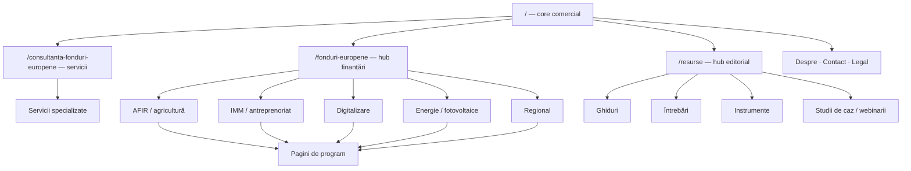

# P1.01 — Inventar de conținut și harta de intenții

Data snapshot-ului: **2026-07-21**

Sursă: sitemap-ul local generat după consolidările P0
Acoperire: **104/104 URL-uri canonice/indexabile**

## Rezumat

### Tipuri

- core: **3**
- ghid: **34**
- hub: **17**
- instrument: **2**
- întrebare: **3**
- legal: **2**
- program: **25**
- serviciu: **17**
- studiu_de_caz: **1**

### Recomandări

- keep: **80**
- merge: **5**
- rewrite: **19**

## Reguli aplicate

- Fiecare rând are exact o intenție primară controlată.
- Paginile de program au părinte tematic și conduc către un serviciu sau formular prin micro-conversie.
- Ghidurile au rol informațional și CTA ulterior către următorul pas.
- Paginile locale și CAEN sunt marcate pentru rescriere până la demonstrarea unei oferte și experiențe unice.
- `merge` și `noindex` sunt recomandări, nu acțiuni. Niciun redirect și nicio schimbare de indexare nu este produsă de acest task.

## Decizii blocate

| URL | Decizie propusă | Țintă | Motiv | Aprobare/dovadă necesară |
|---|---|---|---|---|
| `/ce-acte-sunt-necesare-fonduri-europene` | merge | `/acte-necesare-fonduri-europene-nerambursabile` | Intenția se suprapune cu /acte-necesare-fonduri-europene-nerambursabile; se păstrează doar conținutul unic după aprobarea SEO/business. | SEO lead + owner de conținut aprobă decizia și migrarea |
| `/consultanta-fonduri-europene` | keep | — | Rol distinct de serviciu, cu o singură intenție primară și conversie proprie. | owner confirmă landing-ul comercial principal; export backlink; conversii CTA/form pe URL |
| `/consultanta-fonduri-europene-bucuresti` | rewrite | — | Pagina locală/CAEN poate rămâne numai cu experiență, ofertă și conținut unic demonstrabil; necesită rescriere și validare. | Owner business confirmă experiența/oferta unică; SEO lead validează query și KPI |
| `/cum-se-verifica-eligibilitatea-fonduri-europene` | merge | `/eligibilitate-fonduri-europene` | Intenția se suprapune cu /eligibilitate-fonduri-europene; se păstrează doar conținutul unic după aprobarea SEO/business. | SEO lead + owner de conținut aprobă decizia și migrarea |
| `/digitalizare-imm` | keep | — | Rol distinct de program, cu o singură intenție primară și conversie proprie. | consultant FABER aprobă statutul programului; pagina țintă devine indexabilă; export backlink; conversii pe ambele URL-uri |
| `/dr-12-afir-instalarea-tinerilor-fermieri` | keep | — | Rol distinct de program, cu o singură intenție primară și conversie proprie. | export backlink; GSC Page+Query; audit duplicare după aprobarea factuală; SEO lead |
| `/dr-14-afir-conditii-eligibilitate-greseli-frecvente` | keep | — | Rol distinct de program, cu o singură intenție primară și conversie proprie. | export backlink; GSC Page+Query; conversii; SEO lead |
| `/dr12-afir` | keep | — | Rol distinct de program, cu o singură intenție primară și conversie proprie. | GSC Page+Query; export backlink pentru ambele URL-uri; conversii; aprobarea statusului DR12 |
| `/dr14` | keep | — | Rol distinct de program, cu o singură intenție primară și conversie proprie. | export backlink; conversii; aprobarea statusului DR14; SEO lead |
| `/eligibilitate-fonduri-europene` | rewrite | — | Rol distinct condiționat în harta P0.09; trebuie eliminată suprapunerea și aprobat KPI-ul propriu. | SEO lead aprobă rolul exclusiv educațional; eliminarea secțiunilor duplicate; GSC Page+Query; export backlink |
| `/firma-consultanta-fonduri-europene` | merge | `/consultanta-fonduri-europene` | Intenția se suprapune cu /consultanta-fonduri-europene; se păstrează doar conținutul unic după aprobarea SEO/business. | comparare cu /cum-alegi-consultant-fonduri-europene; export backlink; conversii; aprobarea owner/SEO lead |
| `/fonduri-europene` | keep | — | Rol distinct de hub, cu o singură intenție primară și conversie proprie. | SEO lead confirmă rolul de hub principal; export backlink pe URL exact; conversii pe URL |
| `/fonduri-europene-bucuresti` | rewrite | — | Pagina locală/CAEN poate rămâne numai cu experiență, ofertă și conținut unic demonstrabil; necesită rescriere și validare. | Owner business confirmă experiența/oferta unică; SEO lead validează query și KPI |
| `/fonduri-europene-caen/0111-culturi-cereale` | rewrite | — | Pagina locală/CAEN poate rămâne numai cu experiență, ofertă și conținut unic demonstrabil; necesită rescriere și validare. | Owner business confirmă experiența/oferta unică; SEO lead validează query și KPI |
| `/fonduri-europene-caen/4321-instalatii-electrice` | rewrite | — | Pagina locală/CAEN poate rămâne numai cu experiență, ofertă și conținut unic demonstrabil; necesită rescriere și validare. | Owner business confirmă experiența/oferta unică; SEO lead validează query și KPI |
| `/fonduri-europene-caen/5610-restaurante` | rewrite | — | Pagina locală/CAEN poate rămâne numai cu experiență, ofertă și conținut unic demonstrabil; necesită rescriere și validare. | Owner business confirmă experiența/oferta unică; SEO lead validează query și KPI |
| `/fonduri-europene-caen/6201-dezvoltare-software` | rewrite | — | Pagina locală/CAEN poate rămâne numai cu experiență, ofertă și conținut unic demonstrabil; necesită rescriere și validare. | Owner business confirmă experiența/oferta unică; SEO lead validează query și KPI |
| `/fonduri-nerambursabile` | rewrite | — | Rol distinct condiționat în harta P0.09; trebuie eliminată suprapunerea și aprobat KPI-ul propriu. | owner aprobă rolul financiar evergreen; SEO lead aprobă query cluster distinct; export backlink pe URL exact; KPI: scroll/CTA spre calculator sau contact |
| `/intrebari/cum-se-calculeaza-cofinantarea-la-fonduri-europene` | merge | `/cum-se-calculeaza-cofinantarea-fonduri-europene` | Intenția se suprapune cu /cum-se-calculeaza-cofinantarea-fonduri-europene; se păstrează doar conținutul unic după aprobarea SEO/business. | SEO lead + owner de conținut aprobă decizia și migrarea |
| `/politica-de-confidentialitate` | rewrite | — | Rolul de legal este util, dar promisiunea, query clusterul sau diferențierea față de URL-urile apropiate trebuie clarificate. | fișa juridică aprobată; aviz juridic; owner confirmă URL-ul legal principal |
| `/resurse-utile` | merge | `/resurse` | Intenția se suprapune cu /resurse; se păstrează doar conținutul unic după aprobarea SEO/business. | SEO lead + owner de conținut aprobă decizia și migrarea |
| `/verificare-eligibilitate-fonduri-europene` | rewrite | — | Rol distinct condiționat în harta P0.09; trebuie eliminată suprapunerea și aprobat KPI-ul propriu. | owner aprobă rolul de serviciu; instrumentarea conversiilor live; eliminarea duplicatelor; export backlink |
| `/granturi-digitalizare-imm` | în afara inventarului canonic | — | Candidat de consolidare P0.09; decizia de redirect nu este aprobată. | Aprobarea factuală/juridică/SEO indicată în poarta P0 |
| `/gdpr` | în afara inventarului canonic | — | Duplicat legal scos din sitemap; 301 rămâne condiționat de avizul juridic. | Aprobarea factuală/juridică/SEO indicată în poarta P0 |

## Livrabile

- Tabel filtrabil: `reports/content-intent-inventory-2026-07-21.html`
- CSV: `reports/content-intent-inventory-2026-07-21.csv`
- Date complete și dovezi: `reports/content-intent-inventory-2026-07-21.json`
- Taxonomie și reguli: `config/content-intent-taxonomy.json`
