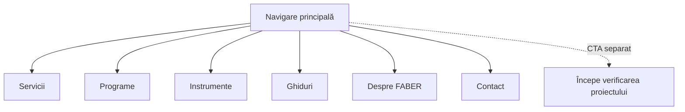

# P1.02 — Sitemap de navigare

Configurație canonică: `config/main-navigation.json`

Breakpoint desktop: **1180px**
CTA separat: **Începe verificarea proiectului** → `/contact`

| Destinație principală | Destinație secundară / URL | Interacțiune |
|---|---|---|
| Servicii | Analiză eligibilitate → `/verificare-eligibilitate-fonduri-europene` | disclosure |
| Servicii | Consultanță → `/consultanta-fonduri-europene` | disclosure |
| Servicii | Proiectare → `/proiectare-fonduri-europene` | disclosure |
| Servicii | Implementare → `/management-proiecte-fonduri-europene` | disclosure |
| Programe | AFIR & agricultură → `/afir` | disclosure |
| Programe | Regional / ADR → `/fonduri-regionale` | disclosure |
| Programe | Digitalizare & inovare → `/fonduri-europene-digitalizare` | disclosure |
| Programe | Energie → `/finantari-panouri-fotovoltaice` | disclosure |
| Programe | Antreprenoriat & GAL → `/fonduri-europene-imm` | disclosure |
| Instrumente | Calculator SO → `/calculator-soc` | disclosure |
| Instrumente | Checklist-uri → `/instrumente` | disclosure |
| Instrumente | Comparații → `/dr12-vs-dr14` | disclosure |
| Ghiduri | Eligibilitate → `/eligibilitate-fonduri-europene` | disclosure |
| Ghiduri | Documente → `/acte-necesare-fonduri-europene-nerambursabile` | disclosure |
| Ghiduri | Cofinanțare → `/cum-se-calculeaza-cofinantarea-fonduri-europene` | disclosure |
| Ghiduri | Glosar → `/glosar-fonduri-europene` | disclosure |
| Ghiduri | Surse oficiale → `/surse-oficiale-fonduri-europene` | disclosure |
| Despre FABER | Echipa → `/despre-faber` | disclosure |
| Despre FABER | Metodologie → `/metodologie-verificare-eligibilitate` | disclosure |
| Despre FABER | Studii de caz → `/studii-de-caz-fonduri-europene` | disclosure |
| Despre FABER | Date companie → `/despre-faber#about-public-data` | disclosure |
| Contact | `/contact` | direct |

## Reguli

- Desktop: cinci disclosure-uri semantice, Contact direct și CTA separat.
- Mobil: butoane disclosure reale cu `aria-expanded`; linkurile nu deschid accidental grupurile.
- Maximum 7 linkuri vizibile în fiecare grup.
- Navigarea nu conține statusuri, etichete de status, date de verificare sau valori de program.
- URL-urile canonice nu sunt schimbate de această configurație.
