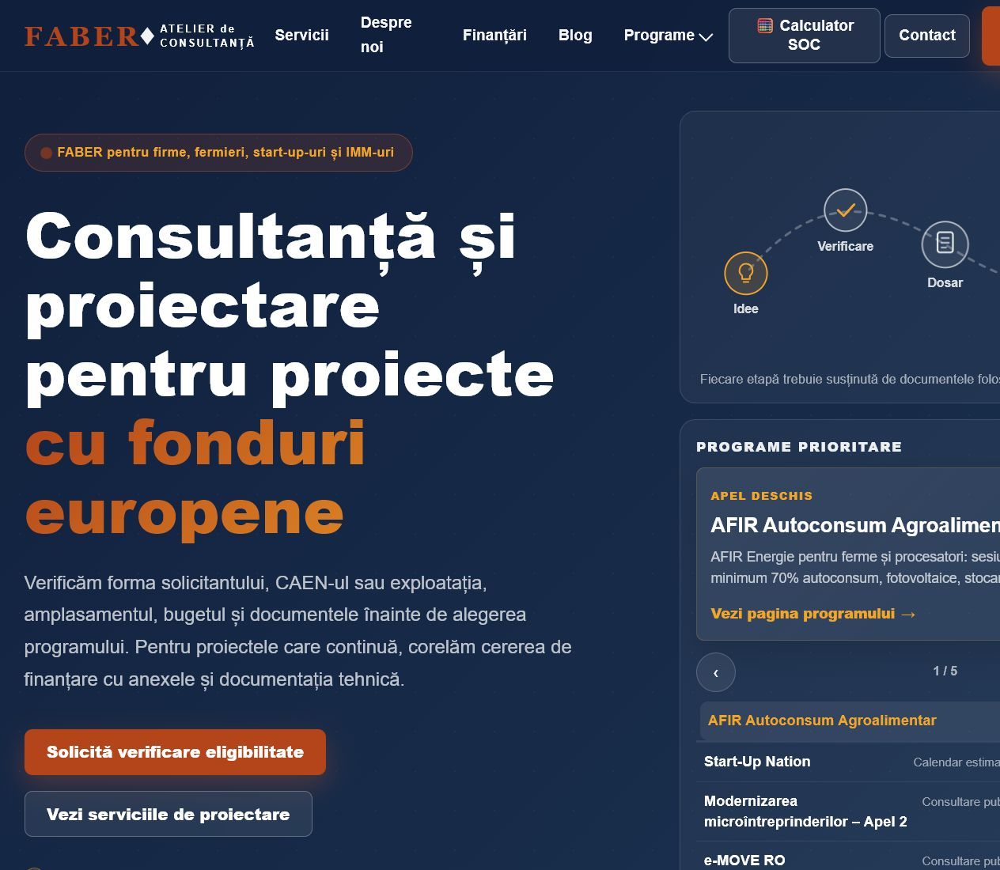
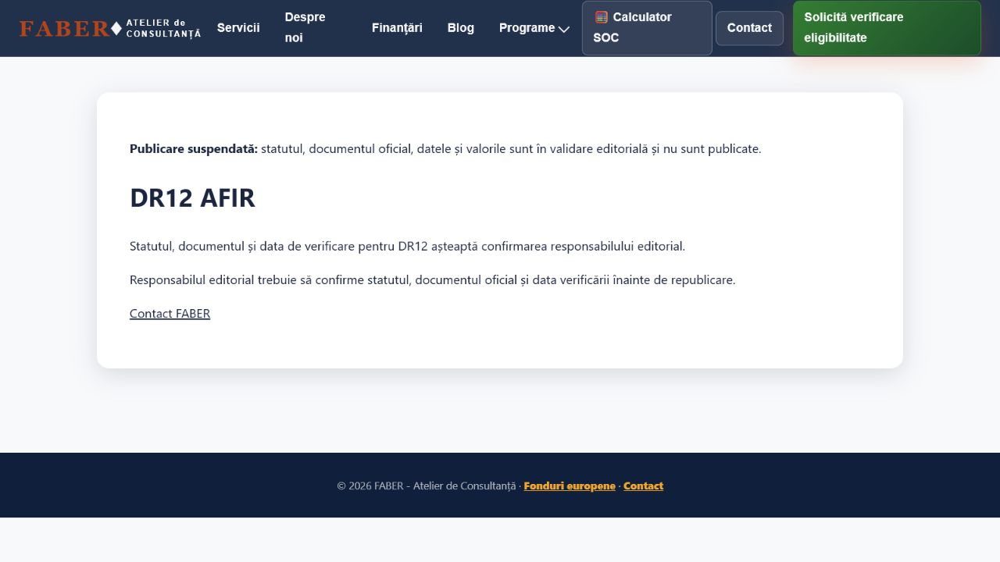
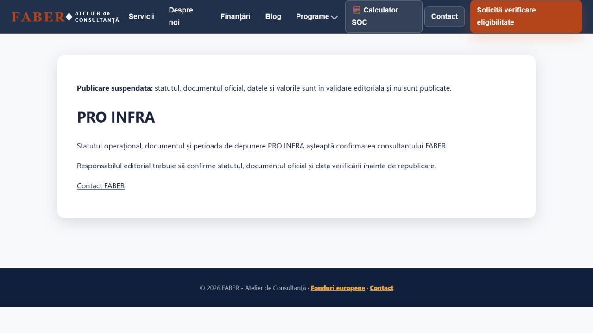

# QA P0.02 — statusuri programe

Data: **2026-07-21**. Build verificat: `dist/`, servit local pe `127.0.0.1:4173`.

## Rezultat

- Homepage: 9 carduri aprobate; 0 componente factuale, linkuri de meniu sau linkuri de footer pentru DR12, DR14, PRO INFRA și Digitalizare IMM.
- Valorile retrase (`200.000 €`, `50.000 €`, `15.000.000 €`, `100.000 €`, respectiv intensitățile asociate) nu apar în secțiunea de finanțări.
- Toate cele 7 URL-uri prioritare sunt disponibile pentru revizuire editorială, dar au `noindex, follow`, `publicationState=pending_validation`, mesaj neutru, 0 JSON-LD factual și 0 valori candidate.

| URL canonic după deploy | Mesaj suspendare | `noindex` | JSON-LD factual | Valori candidate | Rezultat |
|---|---:|---:|---:|---:|---|
| `https://atelierdeconsultanta.ro/dr12-afir` | 1 | da | 0 | nu | PASS |
| `https://atelierdeconsultanta.ro/dr-12-afir-instalarea-tinerilor-fermieri` | 1 | da | 0 | nu | PASS |
| `https://atelierdeconsultanta.ro/dr14` | 1 | da | 0 | nu | PASS |
| `https://atelierdeconsultanta.ro/dr-14-afir-conditii-eligibilitate-greseli-frecvente` | 1 | da | 0 | nu | PASS |
| `https://atelierdeconsultanta.ro/digitalizare-imm` | 1 | da | 0 | nu | PASS |
| `https://atelierdeconsultanta.ro/granturi-digitalizare-imm` | 1 | da | 0 | nu | PASS |
| `https://atelierdeconsultanta.ro/pro-infra` | 1 | da | 0 | nu | PASS |

Serverul static Python folosit pentru capturi nu rezolvă automat rutele fără extensie către fișierele `.html`; pentru acele cazuri a fost deschis fișierul local corespunzător, apoi s-a verificat separat că `<link rel="canonical">` indică URL-ul canonic din tabel.

## Capturi

### Homepage — numai programe aprobate în selectorul prioritar

### DR12 — publicare suspendată

### PRO INFRA — publicare suspendată

